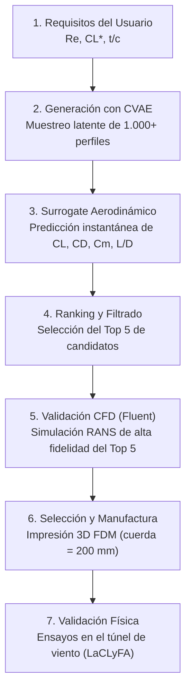

# DIPAS — Diseño Inverso para Perfiles con Autoencoder y Simulación

## Problema

El diseño aerodinámico tradicional (directo) parte de una geometría de perfil alar predefinida y calcula su performance a través de métodos numéricos o experimentales. Encontrar una geometría que cumpla con requisitos específicos de sustentación, resistencia y momento requiere un proceso iterativo de prueba y error sumamente costoso en tiempo de cómputo y de ingeniería.

## Objetivo

Desarrollar **DIPAS**, un sistema de diseño generativo inverso que invierta este proceso: el usuario especifica las características aerodinámicas deseadas (por ejemplo, coeficiente de sustentación objetivo $C_L$ y arrastre mínimo $C_D$ a un número de Reynolds dado) y el sistema genera directamente una geometría de perfil óptima y físicamente válida que cumpla con dichas especificaciones.

## Metodología y Arquitectura del Sistema

El flujo de diseño y optimización generativa de **DIPAS** se estructura en un pipeline secuencial de exploración:

### 1. Modelo Generativo (CVAE)
El núcleo generador es un **Autoencoder Variacional Condicional (CVAE)**:
- **Variables de Condicionamiento (Entradas)**: Coeficiente de sustentación ($C_L$), coeficiente de arrastre ($C_D$), número de Reynolds ($Re$) y espesor relativo máximo ($t/c$).
- **Salida del Modelo**: A partir de una misma condición, el decodificador realiza un muestreo de vectores aleatorios en su espacio latente para generar un **abanico de cientos de perfiles sintéticos viables (coherentes físicamente)** mediante coeficientes CST.

### 2. Filtro Rápido (Surrogate Aerodinámico)
Una red neuronal regresora secundaria (*surrogate model*) entrenada sobre los datos masivos de XFOIL evalúa instantáneamente las geometrías generadas por el CVAE. Predice sus coeficientes integrados ($C_L, C_D, C_M$) y calcula la eficiencia aerodinámica ($L/D$). El sistema rankea y filtra las variantes hasta seleccionar un **Top 5 de mejores candidatos**.

### 3. Validación de Alta Fidelidad y Estrategia de Datos (Transfer Learning)
Para compensar la escasez de datos locales de alta fidelidad, DIPAS implementa una **estrategia de datos multificidad y multi-fuente** basada en aprendizaje por transferencia progresivo (la Escalera de Reynolds):
- **Pre-entrenamiento (UniFoil)**: Se entrena inicialmente el CVAE con las $500{,}000$ simulaciones del dataset UniFoil (NeurIPS 2025) a números de Reynolds altos ($10^6\text{--}10^7$) para que la red aprenda la representación latente geométrica universal de perfiles 2D.
- **Adaptación de Bajo Reynolds (Kanakaero \& UIUC)**: Ajuste intermedio del espacio latente utilizando el dataset de Kanakaero ($2{,}900$ perfiles a $Re=100.000$ parametrizados en CST) y la base de datos experimental de la UIUC ($Re = 100.000\text{ a }500.000$).
- **Ajuste Fino Propio de Baja Fidelidad (DIPAS XFOIL)**: Se sintoniza la red a las polares rápidas con las $146{,}916$ simulaciones de XFOIL sobre los $9{,}931$ perfiles locales.
### 4. Fundamentos Físicos y Justificación de la Metodología Multifidelidad

A números de Reynolds bajos ($Re = 50{,}000 - 200{,}000$), los métodos de baja fidelidad (como XFOIL) sufren de problemas físicos conocidos debido al desarrollo de burbujas de separación laminar (*Laminar Separation Bubbles*, LSB):

| Fenómeno | XFOIL (Método Integral 1D) | ANSYS Fluent (Transition SST $\gamma\text{-}Re_\theta$) | Impacto Físico en el Diseño |
| :--- | :--- | :--- | :--- |
| **Ecuaciones resueltas** | Integrales promediadas 1D en superficie | Navier-Stokes 2D completas (RANS) | ANSYS captura la recirculación y vorticidad real de la burbuja. |
| **Burbujas cortas ($Re > 200k$)** | Razonablemente bueno | Muy preciso | Error pequeño en $C_L$, subestima levemente $C_D$. |
| **Burbujas largas ($Re \le 100k$)** | Falla o no converge (viola hipótesis capa límite delgada) | Modela la deformación real del campo de presión ($C_p$) | XFOIL predice desprendimientos irreales o diverge numéricamente. |
| **Gradiente de presión y curvatura** | Aproximación parabólica | Tensor de tensiones de Reynolds completo (4 ecuaciones) | ANSYS predice con exactitud el *plateau* de presión en intradós/extradós. |
| **Predicción de Drag ($C_D$)** | **Subestima $C_D$ entre 15% y 35%** | Muy cercano a datos de túnel de viento UIUC | La energía disipada dentro del vórtice de la burbuja no se capta en 1D. |

#### Impacto Crítico en el Proceso de Diseño:
1. **Subestimación de la Resistencia ($C_D$)**: Un perfil diseñado solo con XFOIL a $Re=100.000$ que reporte $C_D = 0.012$, al ensayarse en túnel o en Fluent tendrá un arrastre real de $0.016 - 0.018$ (hasta un 30% más de arrastre por disipación viscosa de la burbuja).
2. **Histéresis y saltos en la polar**: La formación y movimiento de la burbuja causa ondulaciones no lineales en la curva $C_L$ vs $\alpha$ que XFOIL tiende a suavizar artificialmente o fallar por no convergencia.
3. **Pérdida prematura y momento de cabeceo ($C_M$)**: A $\alpha \ge 6^\circ - 8^\circ$, la burbuja se desplaza al borde de ataque alterando drásticamente el centro de presiones y la estabilidad longitudinal del UAV.

#### Justificación del Valor Académico de DIPAS:
* **Baja Fidelidad (XFOIL / UniFoil)**: Explora el espacio global y aprende la topología del perfil a costo computacional cero (milisegundos).
* **Alta Fidelidad (ANSYS Transition-SST)**: Corrige la física de la burbuja laminar y calibra la resistencia real.
* **CVAE + Surrogate Híbrido**: Fusiona ambos mundos para lograr **inferencia instantánea con precisión física de CFD**.

## Validación Experimental
Para cuantificar y cerrar la brecha entre la simulación y la realidad física (*simulation-to-reality gap*):
1. **Validación Ciega Externa**: Se separa un 20% del dataset experimental de la UIUC de perfiles no vistos por el modelo durante el entrenamiento para actuar como control y verificar la generalización.
2. **Fabricación**: El perfil ganador del Top 5 de DIPAS se imprime en 3D (PLA/FDM, cuerda de $200\text{ mm}$) con tomas de presión internas.
3. **Ensayo**: Se ensaya en el túnel de viento de la facultad ($V \approx 10\text{ a }25\text{ m/s}$), adquiriendo datos de fuerzas y coeficientes de presión ($C_p$).
4. **Comparación**: Contraste final de los datos reales del túnel contra las predicciones de XFOIL, ANSYS Fluent y la IA generativa.

## Alcance

- **Geometría**: Perfiles aerodinámicos bidimensionales (2D) con cuerda de $200\text{ mm}$ y espesor de borde de fuga estructurado ($\ge 0{,}6\text{ mm}$).
- **Régimen**: Subsónico incompresible, acotado a números de Reynolds bajos ($100.000\text{ a }300.000$), típico de UAVs y aeromodelos de competencia.
- **Flujo**: Estacionario.
*Este acotamiento es un límite formal y operativo del diseño del proyecto, no una omisión.*

## Fuera de Alcance

- Modelado o simulación de efectos tridimensionales (alas completas, puntas de ala, interacción con el fuselaje).
- Regímenes de flujo transónico, supersónico o compresible.
- Comportamientos dinámicos o inestacionarios (flapping, ráfagas, dinámica del desprendimiento dinámico/stall dinámico).
